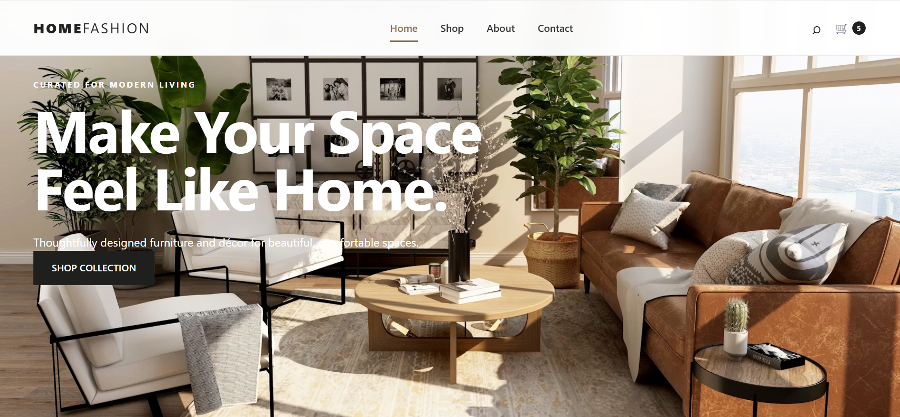
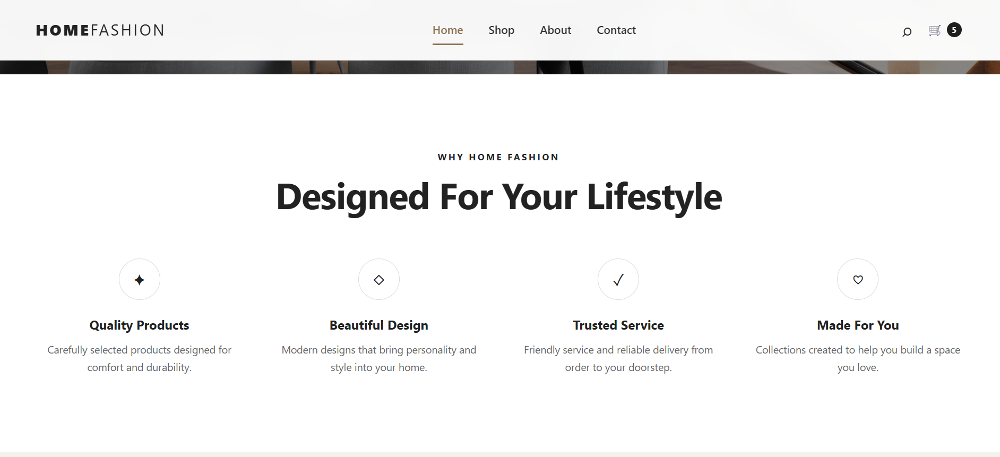
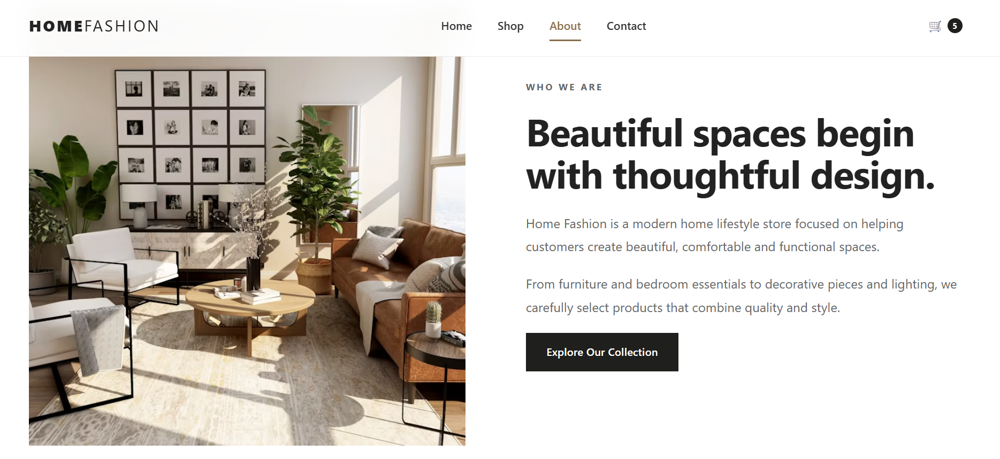
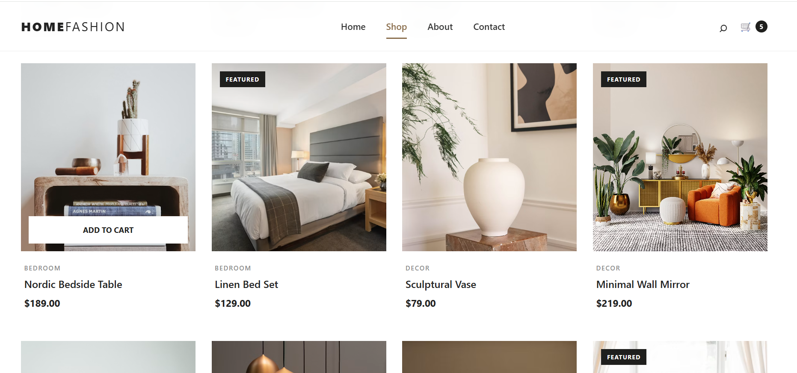
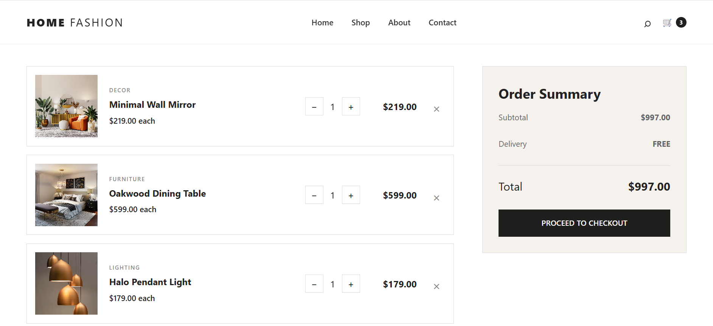
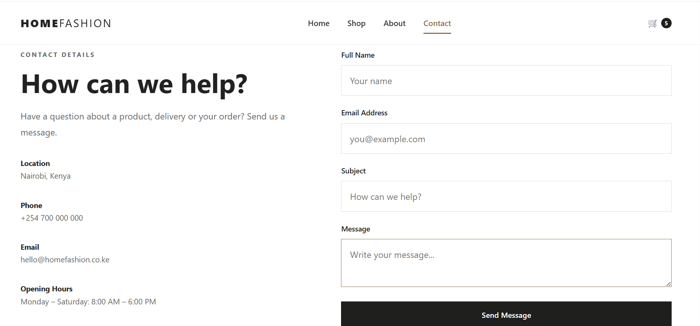

# Home Fashion E-commerce Website

A modern, responsive home fashion e-commerce website built with HTML, CSS and JavaScript.

The project was created as a portfolio project to demonstrate front-end development, responsive design, product presentation and client-side shopping cart functionality.

## Live Demo

Coming soon.

## Screenshots

### Home Page





### Footer Section


### About Page



### Shop Page



### Shopping Cart



### Contact Page



## Features

- Responsive homepage
- Product collection
- Product detail pages
- Product categories
- Shopping cart
- Add products to cart
- Increase and decrease product quantities
- Remove products from cart
- Dynamic cart item count
- Automatic subtotal and total calculation
- Persistent cart using browser localStorage
- Mobile-friendly navigation

## Technologies Used

- HTML5
- CSS3
- JavaScript
- Git
- GitHub
- VS Code

## Project Structure

```text
home-fashion-ecommerce/
│
├── index.html
├── shop.html
├── product.html
├── cart.html
│
├── css/
│   └── style.css
│
├── js/
│   ├── main.js
│   └── products.js
│
└── README.md